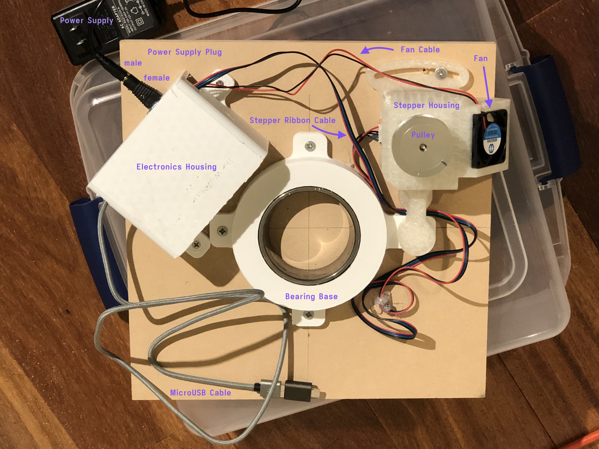
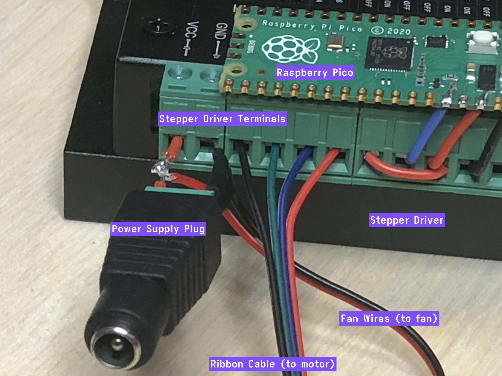

# Wavetable Troubleshooting Guide (Raspberry Pico)

## Using This Guide

For each step below, troubleshoot the symptom with the sub-bullet points if that symptom is present. 

Before using this guide, take the top off of your Wavetable by lifting the top and letting it be pulled to the side. Here are some photos of a correctly assembled Wavetable:

## The Guide

0. Is the table spinning smoothly? 
    - Check that the bearing is spinning smoothly and not squaking. If the bearing does not feel oiled, try adding some mineral oil. 
    - Check that the bearing is not rubbing against the bottom base. Use a whiteboard marker to mark the bottom of the bearing race, then push the bearing race into the track and rotate the bearing around. If the whiteboard marker has not been wiped off of the bottom of the bearing race, then there is bearing is not rubbing against the bottom base. 
2. Is the fan blowing air? If not:
    - Check that the power adapter is plugged into the wall and into the female plug sticking out of the stepper driver. 
    - Look at where the wires between the two green terminals (between the black, plastic power adapter and black, metal stepper driver with cooling fins). Are there two additional wires attached there that go to the fan?
    - Feel the rear center of the fan. Is it hot? If it burns to touch, the fan is short circuiting, and needs to be replaced. 
    - Is the power supply getting power? Use a multimeter to check that there are 12V across the green terminal screws attached to the female end of the power supply plug. Try using a different device with the outlet. 
3. Is there a green light / glow on the green Raspberry Pico microcontroller board? If not:
    - Is the Raspberry Pico plugged into USB power? Try unplugging it, blowing on the port, and plugging it in again. 
    - Is the Raspberry Pico getting USB power? Try using a different device with the USB port, or a different **charging AND data** microusb cable. 
    - Perhaps the firmware has not been installed properly. Re-flash the software as per the [setup guide](https://github.com/Exr0nProjects/wavetable_pico/blob/main/docs/installing.md).
4. Is the motor locked in place and hard to turn? If not:
    - The motor is not getting power from the stepper driver. Is the 4-wire ribbon fully plugged into the stepper motor?
    - Are all four ribbon cable wires firmly inside their respective green terminals on the stepper driver, with the screws tightened? 
5. With both the Raspberry Pico plugged into USB power and the stepper driver plugged into wall power, is the motor spinning? If not:
    - If all previous steps are working, then the stepper driver is not recieving "pulse" commands from the Raspberry Pico.
    - Are all of the wires between the Raspberry Pico and stepper driver fully soldered, connected, and clamped in? 
6. Are you able to send commands to the Wavetable (guides for [MacOS](./macos_with_screen.md) and [Windows](./windows_with_PuTTY.md))? If not:
    - Try unplugging everything and plugging them back in.
    - Try re-flashing the firmware as described in the [setup guide](./installing.md).

Once the motor is spinning, you should have a fully functioning Wavetable. Unplug the Raspberry Pico to reset the Wavetable, then replace the top using [the technique in this video](https://youtu.be/wMTUcSZExBw).
