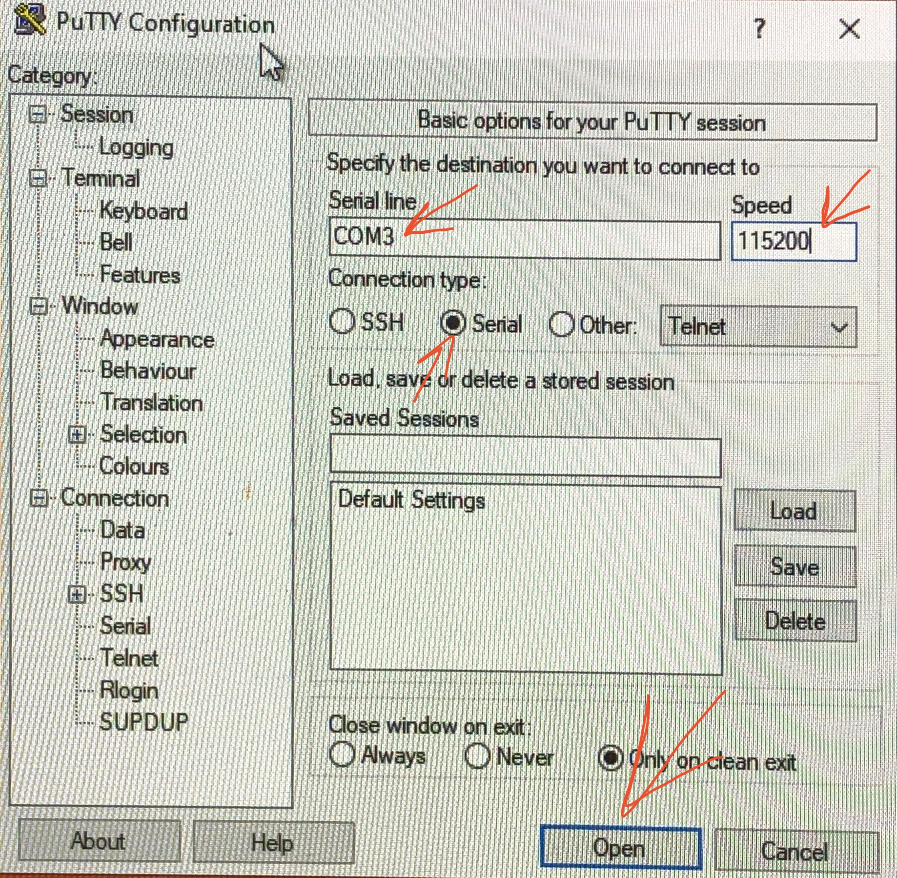

# Interacting with the Wavetable using PuTTY on Windows

Sourced from [this article by PiCockpit](https://picockpit.com/raspberry-pi/raspberry-pi-pico-and-micropython-on-windows/#Connecting_to_the_Pico_Windows_10).

0. Download [PuTTY](https://www.microsoft.com/en-us/p/putty-unofficial/9n8pdn6ks0f8#activetab=pivot:overviewtab), which will be used to open a connection to your Wavetable. 
1. Start by plugging in both the power supply and microcontroller on the Wavetable. The fan should start blowing air, the table should start spinning, and a green light should turn on on the microcontroller (next to where the USB cable plugs into the green circuit board).
2. Open PuTTY.
3. Select "Serial" next to "Connection type:"
4. Enter "COM3" in the "Serial line" box that appears.
5. Enter "115200" in the "Speed" box. 
6. Click "Open" at the bottom of the window. A new, black window should appear with a block cursor. 
7. In the new window, type "info" then press enter. No text will appear while you are typing. After pressing enter, some information about the software configuration and current rotation should appear. 

Now, you are ready to control your Wavetable! The valid commands are listed below. To use one, just type the command, then the number(s), and press enter. **No text will appear while you are typing.** 

| Command                | Description                                                |
|------------------------|------------------------------------------------------------|
| `set 3.2`  | Ramp up/down speed to the target RPM.                              |
| `fset 3.2` | Force set the speeed without interpolation.                        |
| `lset 3.2 10` | Set speed to `x` RPM with linear interpolation at `y` RPM per min. |
| `sina 0.1` | Set the amplitude of the sine wave (0 to disable).                 |
| `sinf 0.01` | Set the frequency of the sine wave, in Hz.                         |
| `info`         | Print software configuration information.                          |

The numbers above are just placeholders. Try setting different speeds! Most RPM values will be between `0.1` and `20`.

If the microcontroller says "unrecognized command", there may have been unexpected characters in the input. 

To stop the Wavetable, set the speed to zero with `set 0` to slow down the table, then unplug it.

